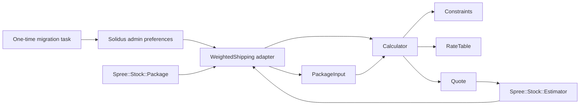
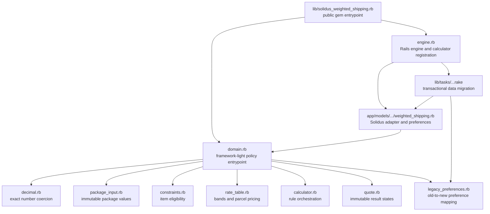
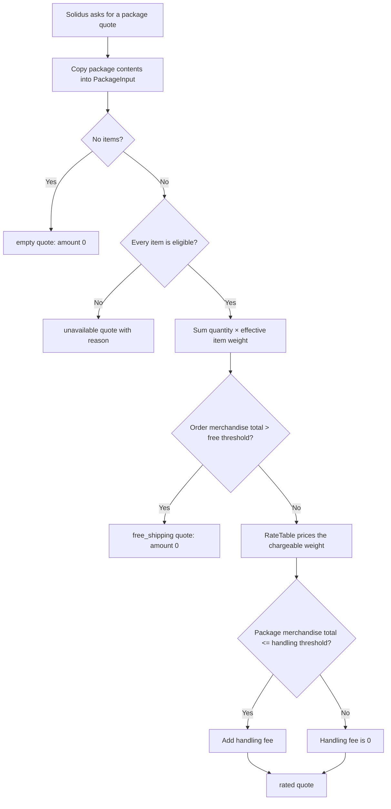
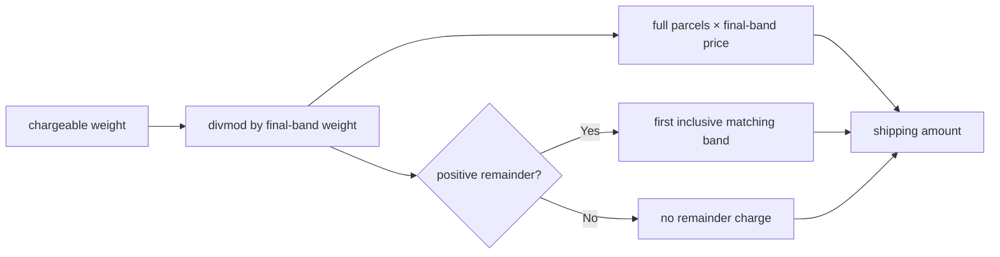
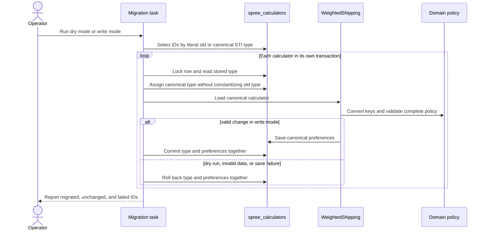
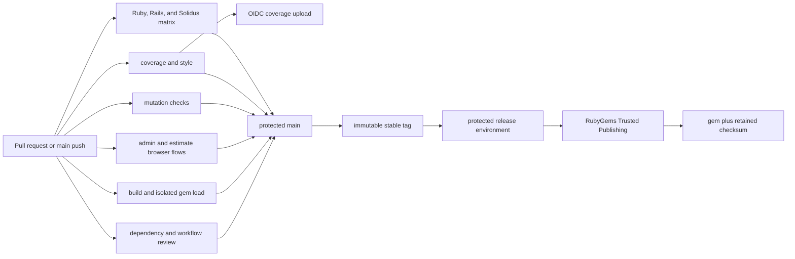

# Code and behavior guide

This is the technical map for Solidus Weighted Shipping. It explains what runs
at checkout, where each rule lives, how old data is migrated, and what must pass
before the gem can be released.

## System boundary

The gem owns one policy: turning a Solidus stock package and merchant settings
into a deterministic shipping quote. Solidus still owns zones, shipping
methods, stock locations, packages, selected rates, shipments, and order state.



There are no carrier requests, credentials, labels, tracking records, pickup
points, unit conversions, or shipment mutations. Parcel chunks exist only long
enough to calculate a price; they are not persisted as Solidus shipments.

## Code map



| Path | Responsibility |
| --- | --- |
| `lib/solidus_weighted_shipping.rb` | Loads the version, policy objects, and Rails engine for normal gem use. |
| `lib/solidus_weighted_shipping/domain.rb` | Loads the rating domain without booting Rails; useful for isolated tests and tooling. |
| `lib/solidus_weighted_shipping/engine.rb` | Registers the calculator after Solidus initializes its calculator list and loads the migration task. |
| `app/models/spree/calculator/shipping/weighted_shipping.rb` | Translates Solidus packages and preferences into domain values, validates settings, caches immutable policies, and returns amounts to Solidus. |
| `lib/solidus_weighted_shipping/decimal.rb` | Accepts finite exact decimals and rejects binary floats or non-terminating rationals. |
| `lib/solidus_weighted_shipping/package_input.rb` | Copies package items, quantities, prices, weights, dimensions, order merchandise total, and currency into immutable values. |
| `lib/solidus_weighted_shipping/constraints.rb` | Applies maximum item weight and orientation-independent dimension rules. |
| `lib/solidus_weighted_shipping/rate_table.rb` | Parses and validates bands, selects a band, and decomposes weights above the final band. |
| `lib/solidus_weighted_shipping/calculator.rb` | Applies empty-package, eligibility, free-shipping, rate, and handling rules in order. |
| `lib/solidus_weighted_shipping/quote.rb` | Represents one valid `rated`, `free_shipping`, `unavailable`, or `empty` result. |
| `lib/solidus_weighted_shipping/legacy_preferences.rb` | Converts historical preference keys into the canonical shape without knowing Active Record. |
| `lib/tasks/solidus_weighted_shipping.rake` | Migrates stored calculator types and preferences with row locks and per-record transactions. |
| `config/locales/*.yml` | Supplies calculator and preference labels for the supported admin locales. |
| `spec/solidus_weighted_shipping` | Unit contract for every domain object and boundary. |
| `spec/integration`, `spec/spree`, `spec/tasks` | Exercises the real Solidus adapter, estimator, persistence, and migration. |
| `spec/properties` | Checks invariants across generated weights, dimensions, rates, and orientations. |
| `spec/system` | Verifies the real admin and customer estimate flows and captures browser evidence. |
| `spec/packaging` | Checks the gem identity, file set, metadata, and dependency boundary. |
| `.github/workflows` | Runs compatibility, quality, mutation, browser, packaging, security, and trusted-release jobs. |

## Runtime entrypoints

Applications load the engine with:

```ruby
require "solidus_weighted_shipping"
```

Code that needs only the pure policy can load:

```ruby
require "solidus_weighted_shipping/domain"
```

The engine registers
`Spree::Calculator::Shipping::WeightedShipping`. No historical require,
namespace, or calculator constant is shipped. The old calculator name appears
only as a literal persisted value understood by the migration task.

## Configuration contract

| Preference | Default | Meaning |
| --- | ---: | --- |
| `rate_table` | `1: 6` through `20: 18` | One `maximum weight: price` band per line. |
| `maximum_item_weight` | `18` | Highest allowed weight for one item. |
| `maximum_item_width` | `60` | Highest allowed second-longest side. |
| `maximum_item_length` | `120` | Highest allowed longest side. |
| `free_shipping_threshold` | `120` | Order merchandise total above which shipping is free. |
| `handling_threshold` | `50` | Package merchandise total at or below which handling applies. |
| `handling_fee` | `10` | Fee added when the handling rule matches. |
| `default_item_weight` | `1` | Weight used when an item has no positive weight. |

Rate thresholds must be positive and strictly increasing. Prices and fees must
be non-negative. A table may contain at most 1,000 bands. The adapter validates
the complete policy when the calculator is saved and fails closed during
estimation if stored input is invalid.

Weights and dimensions remain in the host store's configured product units.
Money values are decimal amounts in the package currency, not integer minor
units. A single calculator does not hold different rate tables per currency.

## Rating logic



The scopes and boundaries are intentional:

- Item limits, chargeable weight, rate bands, and handling use the package
  currently being estimated.
- Free shipping uses the whole order merchandise total.
- Free shipping is strict: equality at the threshold is still charged.
- Handling is inclusive: equality at the threshold includes the fee.
- Missing, zero, or negative historical item weight uses the positive fallback.
- Quantity multiplies both merchandise value and effective weight.

For dimensions, `Constraints` sorts the three sides. The longest side is
compared with `maximum_item_length`; the second-longest is compared with
`maximum_item_width`. Rotating a product therefore cannot change eligibility.
Missing dimensions are treated as zero, while negative dimensions are rejected.

### Rate and parcel calculation

A weight at or below the last configured threshold uses the first band whose
maximum includes it. Band boundaries are inclusive.

For a larger weight, `RateTable` divides the total by its final maximum weight.
Every full parcel is charged the final-band price; a positive remainder is
charged once at its first matching band.



All arithmetic uses `BigDecimal`. Integers, decimal strings, `BigDecimal`, and
terminating `Rational` values are accepted. Floats, infinities, malformed
numbers, and non-terminating rationals are rejected so configuration cannot
silently acquire binary rounding error.

## Quote contract

`Quote` is immutable and permits only these states:

| Status | Amount | Parcels | Reason | Available to Solidus |
| --- | ---: | ---: | --- | --- |
| `rated` | non-negative | at least 1 | none | yes |
| `free_shipping` | `0` | `0` | none | yes |
| `empty` | `0` | `0` | none | yes |
| `unavailable` | none | `0` | eligibility reason | no |

Contradictory combinations raise `InputError`. The adapter maps an unavailable
or invalid quote to the public Solidus calculator contract: `available?`
returns `false` and `compute_package` returns `nil`.

## Adapter and cache behavior

The adapter reads only `Spree::Stock::Package#contents` for package-scoped
values. It reads `package.order.item_total` solely for the documented
order-scoped free-shipping rule, falling back to the package merchandise total
when no order is attached.

Parsed policy objects are memoized against a frozen signature containing every
effective preference value, its class, and its string representation. Any
preference change creates a new signature and policy. The cache lives only on
the calculator instance and is never persisted. Rating does not write to the
database or mutate the order, package, variants, or preferences.

## Legacy data migration

The migration is a deployment operation, not a runtime bridge.



The task is deterministic and skips already-canonical records. A successful
write removes the old keys and changes the STI type, so rollback to the old gem
requires the database backup taken before migration. The full operator sequence
and key mapping are in [migration.md](migration.md).

## Verification and release path



The suite combines examples, generated properties, mutation testing, real
Solidus records and estimation, browser flows, packaging checks, and isolated
loads of the built gem. Coverage is generated as LCOV, enforced
locally, and uploaded to Codecov with GitHub OIDC; no long-lived Codecov token
is stored.

Use these guides for operational detail:

- [Architecture decisions and non-goals](architecture.md)
- [Migration runbook](migration.md)
- [Testing matrix and evidence](testing.md)
- [Security and reliability](security.md)
- [Troubleshooting](troubleshooting.md)
- [Release procedure](release.md)
- [Final audit record](final-audit.md)
